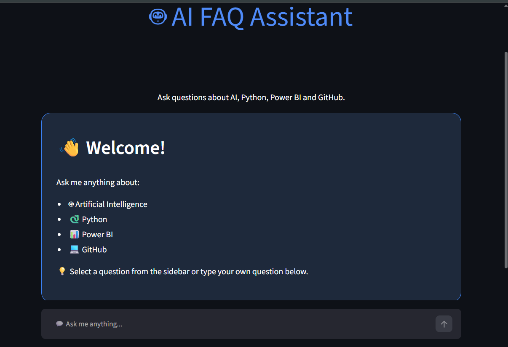
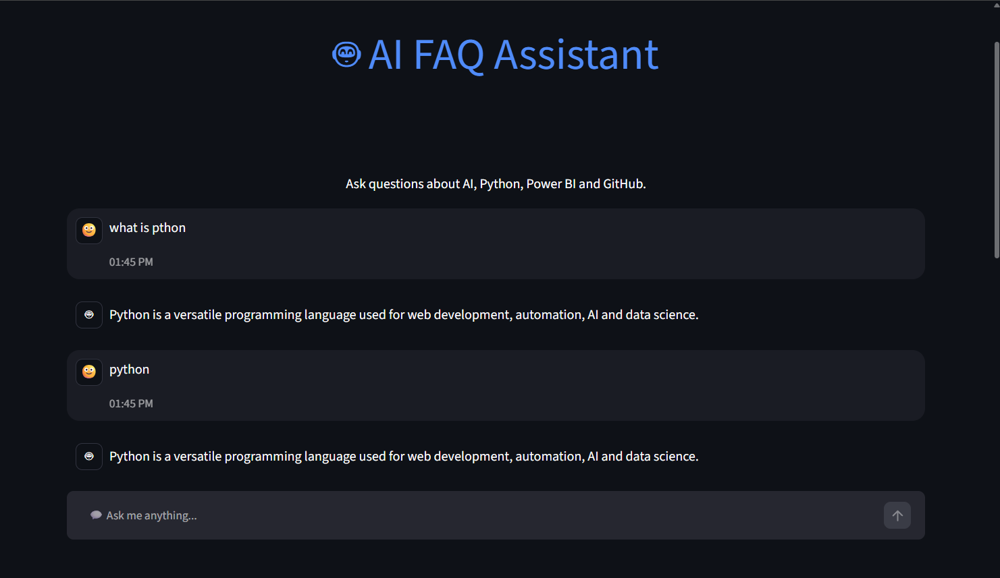
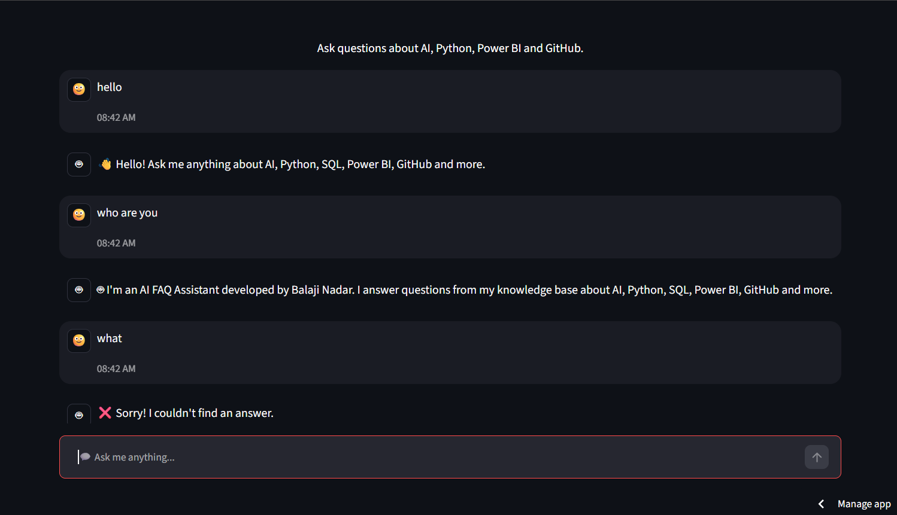

# 🤖 AI FAQ Assistant

An intelligent FAQ chatbot built using **Python**, **Pandas**, and **Streamlit**.

The chatbot answers user questions using **Exact Matching**, **Fuzzy Search**, and **Keyword Matching** while providing a clean, responsive chat interface.

---

# 🌐 Live Demo

🚀 **Try the application here**

https://ai-faq-chatbot-sxcpnkr5j7twmxvlyb6udr.streamlit.app/

---

# ✨ Features

- 🤖 Interactive AI FAQ Chatbot
- 📚 200+ FAQ Knowledge Base
- 🔍 Exact Question Matching
- 🧠 Fuzzy Search (Handles Typing Mistakes)
- 🔑 Keyword-Based Search
- 👋 Greeting Detection
- 🙋 "Who are you?" Response
- ❌ Smart "No Answer Found" Suggestions
- 💬 Modern Chat Interface
- 📊 Project Statistics Dashboard
- 🗑️ Clear Chat Button
- 🌙 Dark Theme UI
- 📱 Responsive Sidebar
- ⚡ Fast Response Time
- ☁️ Deployed on Streamlit Community Cloud

---

# 🛠️ Tech Stack

- Python
- Pandas
- Streamlit
- Difflib
- Regular Expressions (re)
- Git
- GitHub
- Streamlit Community Cloud

---

# 📂 Project Structure

```text
AI-FAQ-Chatbot
│
├── assets
│   └── style.css
│
├── data
│   └── faqs_200.csv
│
├── images
│   ├── home.png
│   ├── smart-chat.png
│   ├── fallback.png
│   └── sidebar.png
│
├── app.py
├── chatbot.py
├── requirements.txt
├── README.md
└── .gitignore
```

---

# 📸 Screenshots

## 🏠 Home Page



---

## 💬 Smart Chat & Fuzzy Search

Shows typo correction and keyword matching.



---

## 🤖 Greetings & Fallback Responses

Demonstrates greeting detection and handling of unknown questions.



---

## 📋 Interactive Sidebar

Shows Quick Questions, Project Statistics, AI Status, and Clear Chat.


---

# 🚀 Installation

### Clone the repository

```bash
git clone https://github.com/Balaji-Analytics/AI-FAQ-Chatbot.git
```

### Move into the project folder

```bash
cd AI-FAQ-Chatbot
```

### Install dependencies

```bash
pip install -r requirements.txt
```

### Run the application

```bash
streamlit run app.py
```

Open your browser and visit

```
http://localhost:8501
```

---

# 💬 Example Questions

- What is AI?
- What is Machine Learning?
- What is Python?
- Explain Python.
- What is Streamlit?
- What is GitHub?
- What is SQL?
- What is Power BI?
- Who developed Python?
- Tell me about AI.

The chatbot also understands:

- Hi
- Hello
- Hey
- Thanks
- Thank You
- Bye
- Who are you?

---

# 🧠 Search Methods

### ✅ Exact Match

Returns an answer when the question exactly matches an FAQ.

---

### ✅ Fuzzy Search

Handles spelling mistakes using Python's **Difflib**.

Example

```
What is pthon?
```

↓

```
What is Python?
```

---

### ✅ Keyword Matching

If an exact or fuzzy match isn't found, the chatbot searches for relevant keywords to provide the best possible answer.

---

### ✅ Smart Suggestions

When no suitable answer exists, the chatbot recommends related questions instead of returning an empty response.

---

# 📊 Project Statistics

- 📚 200 FAQs
- 🤖 AI FAQ Assistant
- 💬 Interactive Chat Interface
- 🔍 Exact Matching
- 🧠 Fuzzy Search
- 🔑 Keyword Search
- 👋 Greeting Support
- 📊 Project Dashboard
- ☁️ Streamlit Cloud Deployment

---

# 🎯 Future Improvements

- 🎤 Voice Input
- 🔊 Text-to-Speech
- 🤖 OpenAI API Integration
- 📂 FAQ Categories
- 🌍 Multi-language Support
- 📥 Export Chat History
- 📈 Analytics Dashboard
- 🗄️ Database Integration

---

# 👨‍💻 Author

## Balaji Nadar

Data Analytics Enthusiast

### Skills

- Python
- SQL
- Power BI
- Excel
- Streamlit
- Git & GitHub

### GitHub

https://github.com/Balaji-Analytics

### LinkedIn

https://www.linkedin.com/in/balaji-nadar-3830a22a5/

---

# ⭐ Support

If you found this project useful, consider giving it a ⭐ on GitHub.

---

# 📄 License

This project was developed for educational and internship purposes.

© 2026 Balaji Nadar. All Rights Reserved.
